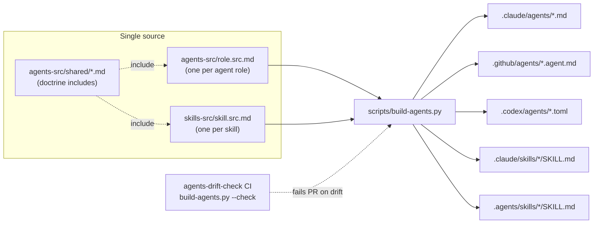
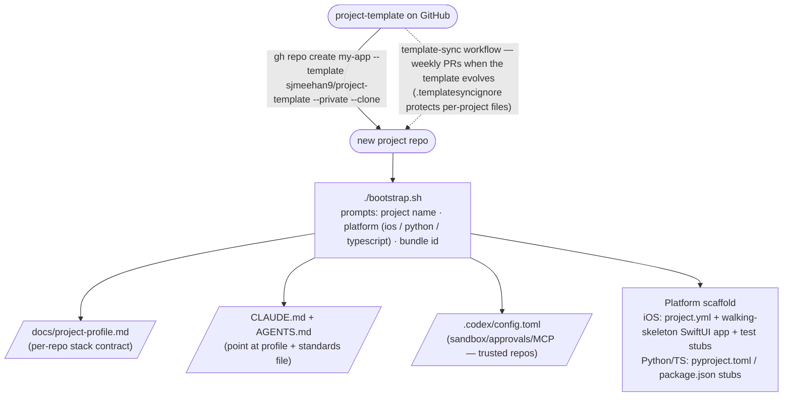
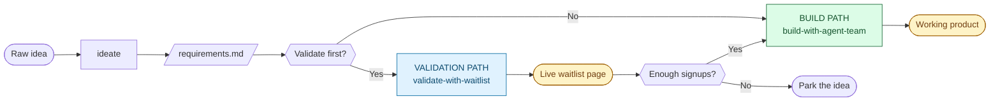
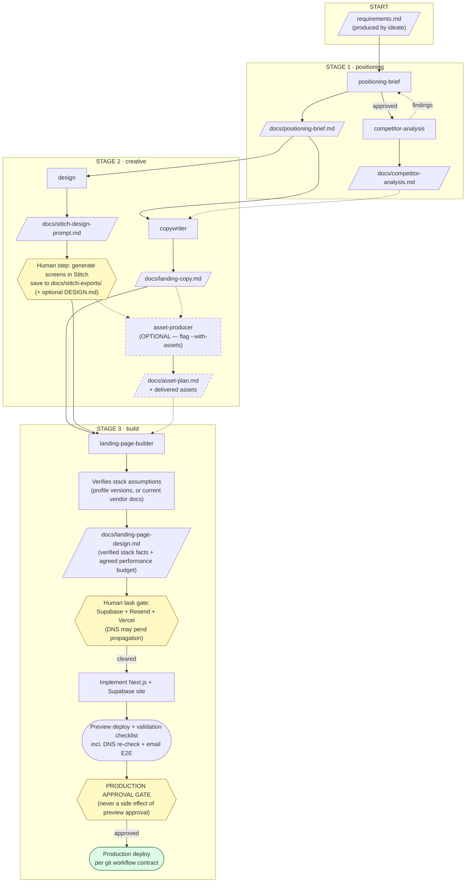
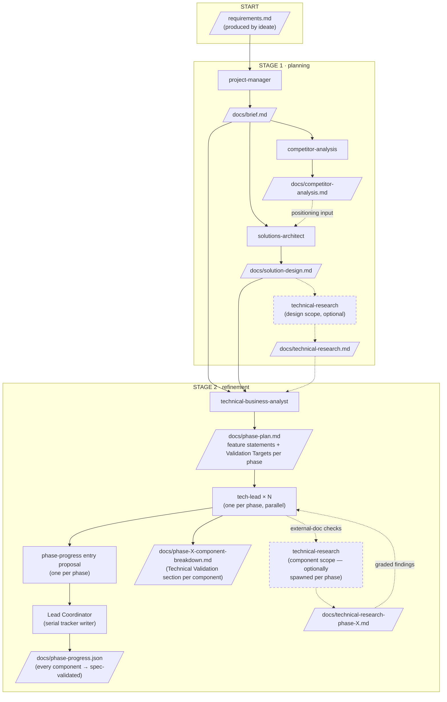
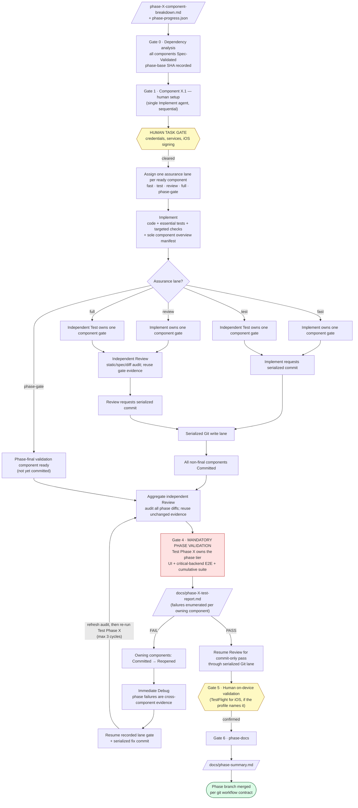
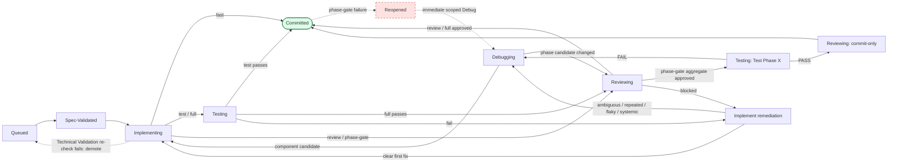
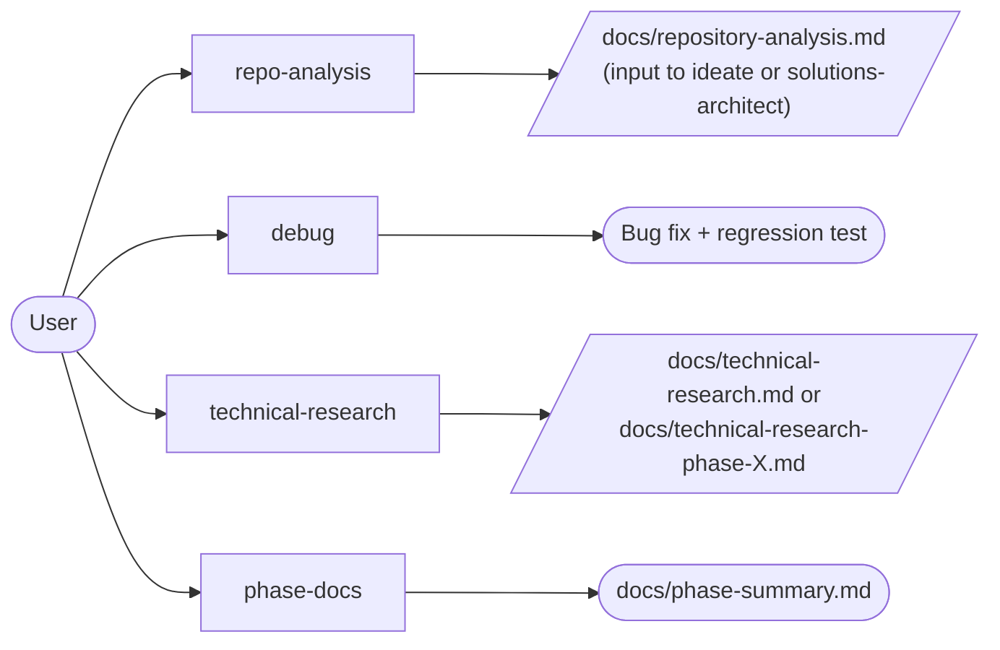
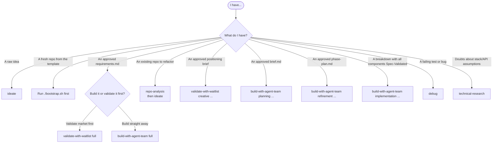

# Agent Flows

A visual map of every intended path through the agent suite. Every agent in `.claude/agents/`, `.github/agents/`, and `.codex/agents/` is **rendered from a single source in `agents-src/`** and belongs to one of the flows below, or is a standalone utility agent.

---

## Repo architecture

This repository is a **GitHub template repo**. Agent and skill definitions are written once — `agents-src/<role>.src.md` per agent, `skills-src/<skill>.src.md` per skill — and rendered by `scripts/build-agents.py` into `.claude/agents/*.md`, `.github/agents/*.agent.md`, `.codex/agents/*.toml`, `.claude/skills/*/SKILL.md`, and `.agents/skills/*/SKILL.md`. Shared doctrine (Agent Report format, priority/sizing doctrines, feature-vertical slicing, bugs-vs-polish rule, profile reference, Steward prompt) lives in `agents-src/shared/*.md` and is spliced in with `%%% include`, so it stays byte-identical across every agent on all three platforms. **Never edit rendered files** — the `agents-drift-check` CI workflow runs `build-agents.py --check` and fails any PR where rendered files don't match source. See [`agents-src/FORMAT.md`](../agents-src/FORMAT.md).



### Bootstrap flow (creating a project from the template)



Agent files are **never customised downstream** — all per-project variability lives in `docs/project-profile.md`, which agents read at runtime. That is what lets the weekly `template-sync` workflow (requires the `TEMPLATE_SYNC_PAT` secret) PR agent/skill updates into generated repos without ever clobbering project content, and lets the drift check keep working there too.

---

## Cross-cutting rules (all agents)

- **Model:** every agent inherits the session model — Claude agents declare `model: inherit`; Copilot and Codex agents omit `model:` entirely. No agent pins a model.
- **Communication:** every message from every agent — including the Lead Coordinator itself — is exactly one concise structured **Agent Report** block (`Status` line + only the applicable Open questions / Outputs created / Problems / Drift / Deferred / Required actions (human) / Next steps sections). Chat contains outcomes, decisions, blockers, artifact paths, and the next owner; transcripts and detailed evidence live in artifacts. Approval gates are Open questions + Required actions with Status BLOCKED.
- **Routing:** in **team mode** (spawned by a skill) all reports go to the Lead Coordinator; in **solo mode** (invoked directly) they go to the user. Task agents never message each other directly.
- **Flat topology:** only the Lead Coordinator spawns task agents. Task agents never spawn children; reuse/follow up with the existing role engagement through its remediation budget.
- **Stack contract:** `docs/project-profile.md` (written by `bootstrap.sh`) is the single source of truth for platform, targeted/component/phase validation tiers, test frameworks and UI/E2E harness, shared-resource locks, coverage policy, project layout, run instructions, git workflow contract, external services / human tasks, and performance budgets. An agent that finds the profile missing or still carrying only the legacy single validation sequence stops and raises profile migration as a blocker; it never guesses commands.
- **Evidence reuse:** every component gate records commands, duration, result, and a scoped `python3 scripts/worktree-fingerprint.py -- [component paths]` identity; the phase gate records the global identity. Scoped identities are commit-stable and can be verified historically with `--rev`. Downstream roles trust passing evidence while its scope is unchanged; a role handoff or unrelated later component never causes a rerun.
- **Serialized shared state:** implementation authoring is serialized by default on the phase branch, with one active component-delivery engagement at a time through its gate and commit. Parallel component authors are opt-in only when the project profile defines a complete branch/worktree integration protocol; isolated worktrees and disjoint files alone do not authorize it. The coordinator leases shared simulators, browsers, mutable test services/databases, and ports one operation at a time. Every Git index, commit, push, and branch-integrating write also passes through one serial lane.
- **Delivery manifest:** `docs/components/phase-X-component-X-Y-overview.md` is the sole component delivery manifest. It records the outcome, delivered files, public interfaces, integration notes, assurance lane, fingerprint, and validation evidence; there is no separate phase-level delivery log.

---

## Two Paths

This template supports two primary paths from "I have an idea" to "the market told me whether to build it":

| Path | Skill (orchestrator) | What it produces | When to use |
|------|---------------------|------------------|-------------|
| **Validation Path** | `validate-with-waitlist` | A live Next.js + Vercel + Supabase waitlist landing page (no real product) | When you want to test market interest before committing to a build |
| **Build Path** | `build-with-agent-team` | A working application, phase by phase, with per-phase UI + critical-backend validation | When the idea is validated (or you're confident enough to skip validation) |



Both skills use the **Steward** checklist as a quality/coherence monitor with no approval authority. The validation skill keeps a persistent Steward; the build skill makes Steward an event-driven **Lead Coordinator duty** at Gate 0, exceptional reports, pre-commit, and stage close—never a separate teammate. Both skills require `docs/project-profile.md` where it applies: always for the build path, and when present for the validation path's Builder.

---

## Path 1 — Validation (`validate-with-waitlist`)

**Goal:** Produce a deployed waitlist landing page that visualises the product without building it. Three stages, each gated on user approval.



`docs/DESIGN.md` is **optional** everywhere: when absent, consumers derive design tokens from `docs/stitch-design-prompt.md` and the screen exports, recording the fallback under *Deferred* — never a blocker.

### Validation path agents — at a glance

| Stage | Agent | Owns |
|-------|-------|------|
| (input) | `ideate` | `docs/requirements.md` |
| Positioning | `positioning-brief` | `docs/positioning-brief.md` |
| Positioning | `competitor-analysis` | `docs/competitor-analysis.md` |
| Creative | `design` | `docs/stitch-design-prompt.md` |
| Creative | `copywriter` | `docs/landing-copy.md` |
| Creative (optional) | `asset-producer` | `docs/asset-plan.md`, `assets/`, `public/assets/optimised/` |
| Build | `landing-page-builder` | `docs/landing-page-design.md`, all source code, `supabase/migrations/`, `.env`/`.env.example` |

### Validation path stage gates

```
ideate          → requirements.md approved
positioning     → positioning-brief.md approved
                → competitor-analysis.md complete (completeness criterion:
                  all materially competing products, stated rationale — no fixed count)
creative        → stitch-design-prompt.md + landing-copy.md approved
                → Stitch screens exported to docs/stitch-exports/ (DESIGN.md optional)
                → asset-plan.md approved + assets delivered (if --with-assets)
build           → stack facts verified (profile, or current vendor docs — never memory)
                → landing-page-design.md approved (incl. agreed performance budget)
                → human task gate cleared (Supabase / Resend / Vercel; DNS may pend)
                → validation checklist passes on preview (incl. email E2E once DNS verifies)
                → preview approved by user
                → PRODUCTION APPROVAL GATE cleared → production live
                  (deploy per the git workflow contract)
```

---

## Path 2 — Build (`build-with-agent-team`)

**Goal:** Take an approved `requirements.md` through a full software delivery: brief → solution design → phase plan → spec-validated component breakdowns → Implement-led, risk-tiered delivery → mandatory independent phase validation → docs. Planning/refinement and true human/external gates require approval; an approved component does not incur another plan-approval wait.

### Stages 1–2 · Planning & Refinement



**Technical Validation (refinement):** after drafting each component spec, the Tech Lead validates it against the project docs **and current external documentation** (SDK/API references, versions, platform rules — for iOS: HIG, App Store review guidelines, entitlements), recording sources, confirmed assumptions, discrepancies, and open risks in the spec's *Technical Validation* section. The Lead Coordinator may spawn `technical-research` in **component scope** per phase to execute those checks (output: `docs/technical-research-phase-X.md`; the Tech Lead remains owner of recording findings). The Tech Lead returns a complete phase-entry proposal; the Lead Coordinator serially records `spec-validated` in `docs/phase-progress.json`. *No Implement agent is ever spawned for a component that is not recorded Spec-Validated.*

### Stage 3 · Implementation (per phase)



**Assurance lanes:** `fast` = Implement gate + Implement commit; `test` = Test gate + Implement commit; `review` = Implement gate + Review commit; `full` = Test gate + Review commit; `phase-gate` = aggregate Review + mandatory Test Phase X + Review commit. Test triggers on UI/OS/external behaviour not fully proven by deterministic component tests, cross-component or persistence round trips, primary-path mocks/fakes, permissions/privacy/security, migrations or destructive state, concurrency/background execution, first use of a runtime/integration pattern, or regression-prone observable behaviour. Review triggers on shared/core/app-entry/build/config/signing files, new or changed public API/schema/protocol/cross-component contracts, security/privacy authorization, a spec deviation or ADR, an open Technical Validation risk, an ownership exception, broad scope, or incomplete/contradictory evidence. Both sets or any critical signal trigger `full`; neither triggers `fast`; the phase-final validation component always uses `phase-gate`.

**Phase validation gate:** Gate 0 records a phase-base SHA. Aggregate Review receives that base plus every ordered component commit SHA, verifies each historical scoped identity with `--rev`, audits the full phase diff, and then `Test Phase X` executes the profile's phase tier and every named **Validation Target** — user-facing flows through the UI harness (XCUITest / Playwright), critical backend paths end-to-end, plus the full cumulative suite — and writes `docs/phase-X-test-report.md`. It is mandatory regardless of which component lanes ran. `phase-docs` and the phase-final commit require PASS; Review resumes for a commit-only pass while the candidate is unchanged. **On iOS, the automated PASS does not substitute for the human TestFlight-on-device gate.**

### Component lifecycle state machine

All components begin `Queued → Spec-Validated → Implementing`; only the states required by the assigned assurance lane follow:

```
fast:       Implementing → Committed
test:       Implementing → Testing → Committed
review:     Implementing → Reviewing → Committed
full:       Implementing → Testing → Reviewing → Committed
phase-gate: Implementing → Reviewing (aggregate) → Testing (Test Phase X) → Reviewing (commit-only) → Committed
```



- **Queued → Spec-Validated** happens during *refinement* (Tech Lead completes the Technical Validation section). At build time the Implement agent re-verifies the spec's external assumptions; a failed re-check **demotes the component to Queued** for re-specification — never silently worked around.
- **No redundant states:** `Testing` and `Reviewing` are skipped when their lane does not require them. Passing gate evidence follows its fingerprint; Review never reruns it merely because the role changed.
- **Component failure remediation:** for a clear component-gate or Review finding, the original Implement receives one bounded remediation attempt. Route to Debug when diagnosis is ambiguous, the same failure repeats, or the behaviour is flaky/systemic. Re-enter the assigned lane at the earliest invalidated gate; max 3 cycles, then escalate.
- **Committed → Reopened** exists only for phase-gate remediation. Each phase-test failure routes immediately to scoped Debug because it is already cross-component/cumulative evidence; resume the component's recorded lane gate and serialized fix commit, refresh the aggregate audit, then rerun `Test Phase X`.
- Statuses are tracked twice, in step: the `agent-team-state.md` lifecycle table and the machine-readable `docs/phase-progress.json`.

### Build path agents — at a glance

| Stage | Agent | Owns |
|-------|-------|------|
| (input) | `ideate` | `docs/requirements.md` |
| Planning | `project-manager` | `docs/brief.md` |
| Planning | `competitor-analysis` | `docs/competitor-analysis.md` |
| Planning | `solutions-architect` | `docs/solution-design.md` |
| Planning → Refinement (optional) | `technical-research` (design scope) | `docs/technical-research.md` |
| Refinement | `technical-business-analyst` | `docs/phase-plan.md` |
| Refinement | `tech-lead` (×N, one per phase) | `docs/phase-X-component-breakdown.md` + a complete phase-progress entry proposal; Lead Coordinator serially writes the shared tracker |
| Refinement (optional, per phase) | `technical-research` (component scope) | `docs/technical-research-phase-X.md` |
| Implementation | `implement` | Source files per component spec · the sole delivery manifest `docs/components/phase-X-component-X-Y-overview.md` · targeted checks · component gate in `fast`/`review` · serialized commit in `fast`/`test` |
| Implementation | `test` | Conditional component gate in `test`/`full`: `docs/test-reports/phase-X-component-X-Y-test-report.md` · mandatory Phase mode (`Test Phase X`): `docs/phase-X-test-report.md` |
| Implementation | `debug` | Escalated component diagnosis/fix after one owner remediation fails or for ambiguous/flaky/systemic failures; immediate owner of phase-test failures |
| Implementation | `review` | Conditional component audit + serialized commit in `review`/`full` · mandatory aggregate phase audit + phase-final commit in `phase-gate`; never reruns valid unchanged-tree evidence |
| Implementation | `phase-docs` | `docs/phase-summary.md` |

### Build path stage gates

```
ideate          → requirements.md approved
planning        → brief.md approved
                → competitor-analysis.md complete (completeness criterion, no fixed count)
                → solution-design.md approved, consistent with brief + competitive findings
                → (optional) technical-research.md — design-scope validation of the stack
refinement      → phase-plan.md approved — every phase states its "a user can now …"
                  feature statement(s) and names its Validation Targets
                → phase-X-component-breakdown.md complete per phase (vertical slices only;
                  Component X.1 = human setup, final component = phase validation)
                → every component's Technical Validation section complete
                → Lead Coordinator serially applies Tech Lead proposals
                → phase-progress.json shows every component spec-validated
implementation  → Gate 0: dependency graph built, all components Spec-Validated,
                  phase-base SHA recorded
                → Component X.1 done → HUMAN TASK GATE cleared
                → each ready component receives exactly one assurance lane:
                  fast (Implement gate + commit), test (Test gate + Implement commit),
                  review (Implement gate + Review commit), full (Test gate + Review commit),
                  or phase-gate (aggregate Review + mandatory Test Phase X + Review commit)
                → one component/phase gate per final source-tree fingerprint; unchanged evidence reused
                → shared validation resources and all Git writes serialized by the coordinator
                → PHASE VALIDATION GATE (mandatory): Test Phase X → docs/phase-X-test-report.md PASS
                  (failures → owning components Reopened → immediate scoped Debug
                   → refresh aggregate audit → re-test, max 3 cycles;
                   PASS gates phase-docs and the phase-final commit)
                → human on-device validation (e.g. TestFlight) if the profile names it
                → phase-docs → phase-summary.md; phase branch merged per git workflow contract
```

---

## Standalone & utility agents

These agents are not part of either skill's fixed orchestration. They are invoked directly by the user (solo mode — reports go straight to the user) or spawned on demand.

| Agent | Purpose | Typical trigger |
|-------|---------|----------------|
| `repo-analysis` | Deep technical analysis of an existing repository — architecture, execution flow, code quality, refactor/reuse classification | "Analyse this repo before we plan a refactor" |
| `debug` | Systematic diagnosis of a bug, error, or test failure | A risk-triggered component failure, repeated/ambiguous defect, or phase-validation failure needs root-cause work |
| `technical-research` | Validates technical assumptions against current external docs — design scope (whole solution design) or component scope (one phase's specs) | "Check the solution design's SDK/version assumptions" |
| `phase-docs` | Phase summary writer (verifies the phase gate itself before writing) | Manually invoked at end of phase if not running through the orchestrator |



---

## Cross-path reuse

Two agents are **shared** between paths and run in both. Their behaviour is identical in either context — only the consumer of their output differs.

| Agent | In validation path | In build path |
|-------|-------------------|--------------|
| `ideate` | First step → produces `requirements.md` | First step → produces `requirements.md` |
| `competitor-analysis` | Validates positioning brief differentiation | Informs `solution-design.md` differentiation |

---

## Platform variants (Claude ↔ Copilot ↔ Codex)

Every agent is rendered for **three** platforms from the same `agents-src/` source — `.claude/agents/<role>.md` (Claude Code), `.github/agents/<Role>.agent.md` (GitHub Copilot), and `.codex/agents/<role>.toml` (OpenAI Codex custom agents) — so the platforms **cannot drift**. Differences are limited to declared platform-conditional blocks:

- **Claude:** `model: inherit`, `memory: project`, Persistent Agent Memory section
- **Copilot:** `tools:`, `argument-hint:` (no team protocol — Copilot has no subagent orchestration)
- **Codex:** TOML format (`name`, `description`, body in `developer_instructions`); no `model` key (inherits the session model)
- **`teams` flag (Claude + Codex):** the Team Collaboration Protocol renders only on platforms that orchestrate subagents

Skills render to both `.claude/skills/<name>/SKILL.md` (Claude Code) and `.agents/skills/<name>/SKILL.md` (the open Agent Skills standard, read by Codex). The build Lead Coordinator runs the event-driven Steward checklist itself on every platform rather than holding a parallel Steward thread. On Codex it spawns task agents by name (they auto-register from `.codex/agents/` in trusted repos, flat fan-out capped by `[agents] max_threads`).

**Autonomous variants** (single-pass: clarification steps and approval waits are replaced by logged *Assumptions*) exist on Claude, Copilot, and Codex for three roles. Only the Solutions Architect *Lite* variants remain Copilot-only:

| Variant of | Mode | Claude | Copilot | Codex |
|------------|------|--------|---------|-------|
| `implement` | autonomous | `implement-autonomous.md` | `ImplementationAutonomous.agent.md` | `implement-autonomous.toml` |
| `project-manager` | autonomous | `project-manager-autonomous.md` | `ProjectManagerAutonomous.agent.md` | `project-manager-autonomous.toml` |
| `technical-business-analyst` | autonomous | `technical-business-analyst-autonomous.md` | `TechnicalBusinessAnalystAutonomous.agent.md` | `technical-business-analyst-autonomous.toml` |
| `solutions-architect` | lite (reduced scope) | — | `SolutionsArchitectLite.agent.md` | — |
| `solutions-architect` | lite + autonomous | — | `SolutionsArchitectLiteAutonomous.agent.md` | — |

Porting a variant to another platform is a small edit to its source file (add a `%%% output:` block with the platform's flags and header, then re-render) — never a file copy.

---

## Decision tree — which agent / path do I invoke?



---

## Skill argument cheat sheet

```bash
# Validation path — shape: <stage> [max-agents] [--with-assets]
/validate-with-waitlist positioning           # stage 1 only
/validate-with-waitlist creative              # stage 2 (no AI assets — uses Stitch exports)
/validate-with-waitlist creative 4 --with-assets   # stage 2 with asset-producer
/validate-with-waitlist build                 # stage 3 only
/validate-with-waitlist full                  # all three, gated on user approval
/validate-with-waitlist full 4 --with-assets  # all three with asset production

# Build path — shape: <stage> [max-agents] [phase-number]
/build-with-agent-team planning               # stage 1 only
/build-with-agent-team refinement             # stage 2 only
/build-with-agent-team implementation 3 1     # stage 3 — phase 1, up to 3 agents
/build-with-agent-team full                   # all three, gated on user approval
```

- **`max-agents`** is a ceiling, not a target. Defaults: validation 4; build planning 4, refinement 4, implementation 3. The build Steward is a coordinator-run duty and consumes no teammate slot; conditional Test, Review, and Debug roles are spawned only when a component's lane or observed failure requires them. Implementation authoring is serialized by default unless the profile defines the complete opt-in integration protocol. Concurrency is otherwise bounded by file/document ownership and shared-resource leases.
- **Validation:** `--with-assets` toggles the optional asset-producer.
- **Build:** the phase number is required (third argument) when stage is `implementation`.

---

## File ownership map (who writes what)

```
CLAUDE.md                                 ← bootstrap.sh
AGENTS.md                                 ← bootstrap.sh (Codex/agents.md entry point)
.codex/config.toml                        ← bootstrap.sh (sandbox/approvals/MCP; trusted repos)
docs/
├── project-profile.md                    ← bootstrap.sh (stack contract) [BOTH]
├── requirements.md                       ← ideate
├── repository-analysis.md                ← repo-analysis
│
├── positioning-brief.md                  ← positioning-brief        [VALIDATE]
├── competitor-analysis.md                ← competitor-analysis      [BOTH]
├── stitch-design-prompt.md               ← design                   [VALIDATE]
├── stitch-exports/                       ← human (Stitch screen exports) [VALIDATE]
├── DESIGN.md                             ← exported from Stitch (OPTIONAL — consumers
│                                            have a token-derivation fallback) [VALIDATE]
├── landing-copy.md                       ← copywriter               [VALIDATE]
├── asset-plan.md                         ← asset-producer (opt)     [VALIDATE]
├── landing-page-design.md                ← landing-page-builder     [VALIDATE]
│
├── brief.md                              ← project-manager          [BUILD]
├── solution-design.md                    ← solutions-architect      [BUILD]
├── technical-research.md                 ← technical-research (design scope) [BUILD]
├── technical-research-phase-X.md         ← technical-research (component scope) [BUILD]
├── phase-plan.md                         ← technical-business-analyst [BUILD]
├── phase-X-component-breakdown.md        ← tech-lead (×N)           [BUILD]
├── phase-progress.json                   ← Lead Coordinator (sole team-mode writer,
│                                            from tech-lead proposals) [BUILD]
├── components/
│   └── phase-X-component-X-Y-overview.md ← implement; sole component
│                                            delivery manifest       [BUILD]
├── test-reports/
│   └── phase-X-component-X-Y-test-report.md ← test (component mode) [BUILD]
├── phase-X-test-report.md                ← test (phase mode)        [BUILD]
├── phase-summary.md                      ← phase-docs               [BUILD]
│
├── agent-team-state.md                   ← Lead Coordinator; build Steward is a coordinator duty [BUILD skill]
└── validation-team-state.md              ← Lead Coordinator + Steward [VALIDATE skill]

(application source code)                 ← landing-page-builder     [VALIDATE]
                                          ← implement                [BUILD]
```

The phase plan is `docs/phase-plan.md` **everywhere** — both platforms, both the TBA and its autonomous variant, and every consumer.

---

## Updating this document

When you add, remove, or rename agents:

1. **Make the change in `agents-src/` (or `skills-src/`), never in rendered files** — edit the `*.src.md` source, run `python3 scripts/build-agents.py`, and let the drift check verify the rendered outputs.
2. Update the relevant Mermaid diagram in the corresponding path section.
3. Update the agent inventory table for that path (and the platform-variants table if a variant was added or ported).
4. Update the file ownership map.
5. If you add a new top-level path (a third skill alongside `build-with-agent-team` and `validate-with-waitlist`), add a new "Path N" section mirroring the structure of paths 1 and 2.
